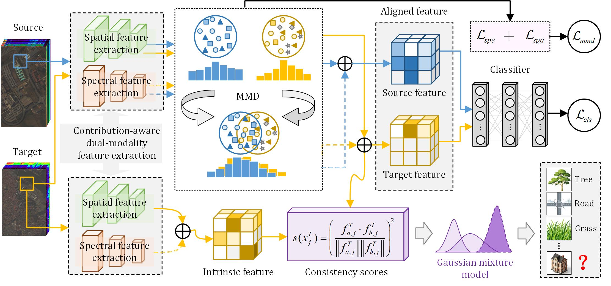

<div align="center">

# SoDa2: Single-Stage Open-Set Domain Adaptation via Decoupled Alignment for Cross-Scene Hyperspectral Image Classification

[](https://doi.org/10.1109/TGRS.2026.3707690)
[](https://doi.org/10.1109/TGRS.2026.3707690)
[](https://www.python.org/)
[](https://pytorch.org/)

<br>

Official PyTorch implementation of our paper published in <br>
**IEEE Transactions on Geoscience and Remote Sensing (TGRS), 2026**

<br>

Yiwen Liu, Minghua Wang, Jing Yao, Xin Zhao, and Gemine Vivone

</div>

<hr>

## 💡 Overview

Cross-scene hyperspectral image (HSI) classification stands as a fundamental research topic in remote sensing, with extensive applications spanning various fields. Owing to the inclusion of unknown categories in the target domain and the existence of domain shift across different scenes, open-set domain adaptation techniques are commonly employed to address cross-scene HSI classification. However, existing open-set cross-scene HSI classification methods still face two critical challenges: (1) domain shift issues arising from the direct alignment of mixed spectral-spatial features; (2) high computational costs caused by two-stage training strategies. To address these issues, this paper proposes a single-stage open-set domain adaptation method with decoupled alignment (SoDa2) for cross-scene HSI classification. A contribution-aware dual-modality feature extraction is customized to disentangle the characteristics from spectral sequence signals and spatial details, selectively and adaptively enhancing discriminative features. The decoupled alignment module minimizes the Maximum Mean Discrepancy (MMD) to independently reduce the spectral discrepancy and the spatial discrepancy between the source and target domains, extracting more fine-grained domain-invariant features. A cost-effective single-stage dual-branch framework is designed to learn MMD-constrainted aligned features and constraint-free intrinsic features for adaptive distinction between known and unknown classes. This framework employs a Gaussian Mixture Model (GMM) to model the squared cosine similarity distribution between the two feature types, enabling open-set recognition without prior knowledge of unknown classes. Extensive experiments on three groups of HSI datasets demonstrate that SoDa2 outperforms state-of-the-art methods, achieving superior classification accuracy and model transferability for open-set cross-scene tasks.

<p align="center">
  
</p>

## ⚙️ Requirements

The code is developed and tested in the following environment:
* Python == 3.8.20
* PyTorch == 1.12.0
* CUDA == 11.6
* Other dependencies: `numpy`, `scipy`, `scikit-learn`, `matplotlib`

## 🔗 Citation

We hope this code is helpful to your research. If you use this repository or find our work useful, please consider citing our paper. Your citations are greatly appreciated and help support our future research.

```bibtex
@article{11580397,
  author  = {Liu, Yiwen and Wang, Minghua and Yao, Jing and Zhao, Xin and Vivone, Gemine},
  journal = {IEEE Transactions on Geoscience and Remote Sensing}, 
  title   = {SoDa2: Single-Stage Open-Set Domain Adaptation via Decoupled Alignment for Cross-Scene Hyperspectral Image Classification}, 
  year    = {2026},
  volume  = {64},
  pages   = {4705513-4705513},
  doi     = {10.1109/TGRS.2026.3707690}
}
